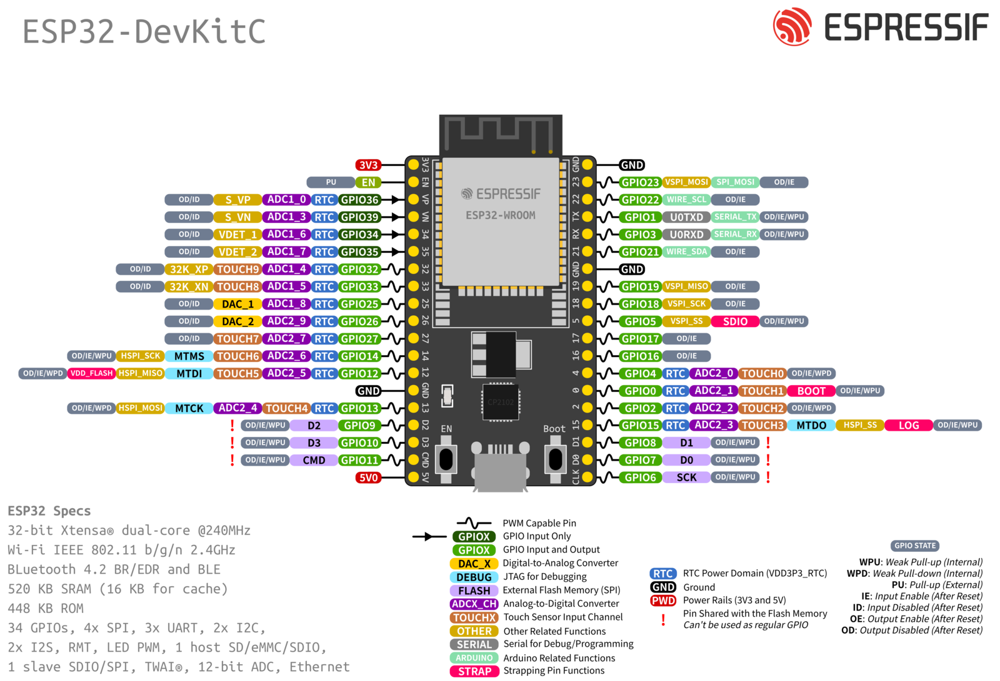

# ESP32 with Espressif
## _Using PlatformIO on VSCode_

Welcome to the ESP32 with Espressif repository! This repository contains a collection of sample code demonstrating how to use the Espressif IDE to program the ESP32 microcontroller. Whether you're a beginner exploring the capabilities of the ESP32 or an experienced developer looking for practical examples, this repository aims to provide you with useful code snippets and projects.

From working with peripherals and utilizing timers to integrating external components and implementing various network functionalities, you'll find a wide range of examples covering different aspects of ESP32 development. The code is written using PlatformIO, a powerful cross-platform IDE that simplifies the development process.

We hope that these examples will help you kickstart your ESP32 projects and inspire you to create innovative solutions leveraging the capabilities of this versatile microcontroller.

## Main Structure

- Use of FreeRTOS
- Peripherals
- Timers
- External Components

## Folder Structure

The repository is structured as follows:

- **I2C**
  - BME280: Example for interfacing with the BME280 sensor over I2C.
  - LCD: Example for driving an LCD display using I2C communication.
  - OLED: Example for controlling an OLED display using I2C.
  - SCAN: Example for scanning and detecting I2C devices connected to the ESP32.
  - MASTER I2C: Example of using ESP32 as an I2C master device.
  - SLAVE I2C: Example of using ESP32 as an I2C slave device.
- **SPI**
  - LoRa: Example for LoRa communication using SPI interface.
  - TFT WITH LVGL: Example for driving a TFT display with LVGL library using SPI.
  - RFID: Example for RFID communication using SPI interface.
  - SPI MASTER: Example of using ESP32 as an SPI master device.
  - SPI SLAVE: Example of using ESP32 as an SPI slave device.
- **Encryption**
  - AES128: Example of AES128 encryption and decryption.
  - RSA: Example of RSA encryption and decryption.
  - SIGN VERIFY RSA: Example of RSA signature generation and verification.
  - SHA256 (HASH): Example of computing SHA256 hash.
  - HMACSHA256 (HASH): Example of computing HMACSHA256 hash.
- **Network**
  - HTTPS SERVER: Example of an HTTPS server on the ESP32.
  - HTTP SERVER: Example of an HTTP server on the ESP32.
  - MQTT CLIENT: Example of an MQTT client on the ESP32.
  - MQTTS CLIENT: Example of an MQTT over TLS client on the ESP32.
  - WIFI TEST (CLIENT HTTP): Example of connecting to a Wi-Fi network and performing HTTP client requests.
  - WIFI SCAN: Example of scanning for available Wi-Fi networks.
  - OTA UPDATE (METHOD POST): Example of performing OTA (Over-The-Air) updates using the POST method.

## Board Pinout

## License

This repository is licensed under the [MIT License](LICENSE). Feel free to use the code and adapt it to your needs. Contributions are also welcome!

For more information about ESP32 and its official documentation, please visit the [Espressif website](https://www.espressif.com/en/products/socs/esp32).
